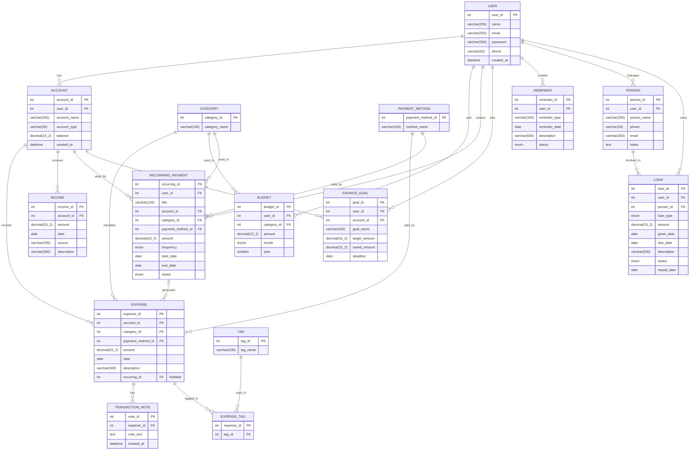
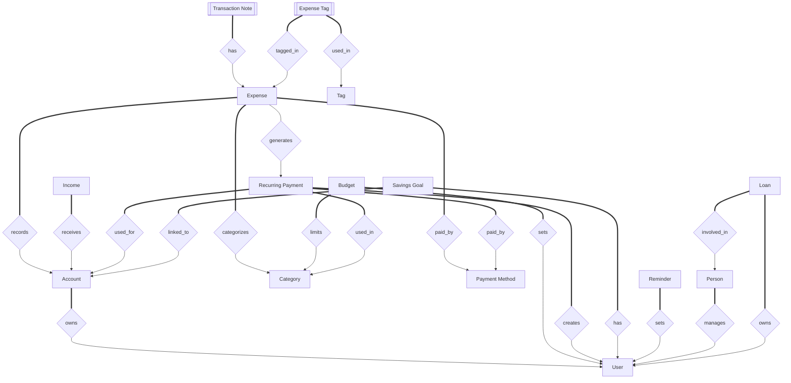

# Expense Tracker — Backend API

Node.js + Express + MySQL REST API with JWT authentication.

---

## Table of Contents

- [Project Structure](#project-structure)
- [Setup](#setup)
- [Generating a JWT Secret](#generating-a-jwt-secret)
- [Environment Variables](#environment-variables)
- [Running the Server](#running-the-server)
- [Authentication](#authentication)
- [API Endpoints](#api-endpoints)
  - [Auth](#auth)
  - [Users](#users)
  - [Accounts](#accounts)
  - [Expenses](#expenses)
  - [Income](#income)
  - [Budgets](#budgets)
  - [Categories](#categories)
  - [Payment Methods](#payment-methods)
  - [Recurring Payments](#recurring-payments)
  - [Savings Goals](#savings-goals)
  - [Reminders](#reminders)
  - [Persons](#persons)
  - [Loans](#loans)
  - [Tags](#tags)
- [Design Notes](#design-notes)

---

---






---

## Project Structure

```
backend/
├── server.js                        # Entry point
├── .env.example                     # Environment variable template
├── package.json
├── config/
│   └── db.js                        # MySQL connection pool
├── middleware/
│   ├── auth.js                      # JWT verification
│   └── errorHandler.js              # Global error handler
├── controllers/                     # Business logic (one file per resource)
│   ├── authController.js
│   ├── userController.js
│   ├── accountController.js
│   ├── expenseController.js
│   ├── incomeController.js
│   ├── budgetController.js
│   ├── categoryController.js
│   ├── paymentMethodController.js
│   ├── recurringPaymentController.js
│   ├── reminderController.js
│   ├── savingsGoalController.js
│   ├── personController.js
│   ├── loanController.js
│   └── tagController.js
├── routes/                          # Express routers (one file per resource)
│   └── ...
└── sql/
    └── schema.sql                   # Full DB schema + seed data
```

---

## Setup

**1. Install dependencies**

```bash
npm install
```

**2. Create your `.env` file**

```bash
cp .env.example .env
```

**3. Initialize the database**

```bash
Get-Content sql/schema.sql | mysql -u root -p
```

This creates the `expense_tracker` database, all tables, and seeds categories and payment methods.

---

## Generating a JWT Secret

Your `JWT_SECRET` should be a long, random, cryptographically secure string. Never use a short or guessable value like `"secret"` or `"myapp"`.

**Option 1 — Node.js crypto (recommended)**

Open a terminal and run:

```bash
node -e "console.log(require('crypto').randomBytes(64).toString('hex'))"
```

Example output:

```
3f6b2a91e4c85d702f1b3e8a9c4d7f2e1a5b8c3d6e9f0a2b4c7d1e3f5a8b2c4d6e9f1a3b5c7d0e2f4a6b8c1d3e5f7a9b
```

Copy that output and paste it as your `JWT_SECRET`.

**Option 2 — openssl (if you have it installed)**

```bash
openssl rand -hex 64
```

**Option 3 — Node.js REPL**

```bash
node
> require('crypto').randomBytes(64).toString('base64')
```

> **Never commit your `.env` file to version control.** The `.gitignore` should include `.env`.

---

## Environment Variables

Edit your `.env` file with these values:

```env
PORT=3000

DB_HOST=localhost
DB_PORT=3306
DB_USER=root
DB_PASSWORD=yourpassword
DB_NAME=expense_tracker

JWT_SECRET=<paste your generated secret here>
JWT_EXPIRES_IN=7d
```

`JWT_EXPIRES_IN` accepts: `60` (seconds), `15m`, `2h`, `7d`, `30d`

---

## Running the Server

```bash
# Development (auto-restart on file changes)
npm run dev

# Production
npm start
```

Server starts on `http://localhost:3000` (or whatever `PORT` is set to).

---

## Authentication

All routes except `/api/auth/register` and `/api/auth/login` require a Bearer token in the `Authorization` header.

```
Authorization: Bearer <your_token>
```

The token is returned from the register and login endpoints. It encodes `user_id`, `email`, and `name`, and expires based on `JWT_EXPIRES_IN`.

---

## API Endpoints

### Auth

#### `POST /api/auth/register`

Register a new user. Returns a JWT token.

**Request body:**
```json
{
  "name": "Deep",
  "email": "deep@example.com",
  "password": "securepassword123",
  "phone": "9876543210"
}
```

**Response `201`:**
```json
{
  "token": "eyJhbGciOiJIUzI1NiIsInR5cCI6IkpXVCJ9...",
  "user": {
    "id": 1,
    "name": "Deep",
    "email": "deep@example.com"
  }
}
```

---

#### `POST /api/auth/login`

Login with existing credentials. Returns a JWT token.

**Request body:**
```json
{
  "email": "deep@example.com",
  "password": "securepassword123"
}
```

**Response `200`:**
```json
{
  "token": "eyJhbGciOiJIUzI1NiIsInR5cCI6IkpXVCJ9...",
  "user": {
    "id": 1,
    "name": "Deep",
    "email": "deep@example.com",
    "phone": "9876543210",
    "created_at": "2024-01-15T10:30:00.000Z"
  }
}
```

---

### Users

#### `GET /api/users/me`

Get the logged-in user's profile.

**Response `200`:**
```json
{
  "id": 1,
  "name": "Deep",
  "email": "deep@example.com",
  "phone": "9876543210",
  "created_at": "2024-01-15T10:30:00.000Z"
}
```

---

#### `PUT /api/users/me`

Update name or phone. Omit any field to leave it unchanged.

**Request body:**
```json
{
  "name": "Deep Shah",
  "phone": "9123456789"
}
```

**Response `200`:**
```json
{
  "message": "Profile updated"
}
```

---

#### `PUT /api/users/me/password`

Change password.

**Request body:**
```json
{
  "current_password": "securepassword123",
  "new_password": "newstrongerpassword456"
}
```

**Response `200`:**
```json
{
  "message": "Password changed successfully"
}
```

---

### Accounts

#### `GET /api/accounts`

List all accounts for the logged-in user.

**Response `200`:**
```json
[
  {
    "id": 1,
    "user_id": 1,
    "account_name": "HDFC Savings",
    "account_type": "savings",
    "balance": "24500.00",
    "created_at": "2024-01-15T10:30:00.000Z"
  },
  {
    "id": 2,
    "user_id": 1,
    "account_name": "ICICI Current",
    "account_type": "current",
    "balance": "8200.00",
    "created_at": "2024-01-16T09:00:00.000Z"
  }
]
```

---

#### `GET /api/accounts/:id`

Get a single account.

**Response `200`:**
```json
{
  "id": 1,
  "user_id": 1,
  "account_name": "HDFC Savings",
  "account_type": "savings",
  "balance": "24500.00",
  "created_at": "2024-01-15T10:30:00.000Z"
}
```

---

#### `POST /api/accounts`

Create a new account. `balance` defaults to 0 if omitted.

**Request body:**
```json
{
  "account_name": "HDFC Savings",
  "account_type": "savings",
  "balance": 25000.00
}
```

`account_type` can be anything: `savings`, `current`, `cash`, `wallet`, `credit`, etc.

**Response `201`:**
```json
{
  "account_id": 1,
  "message": "Account created"
}
```

---

#### `PUT /api/accounts/:id`

Update an account. Any field can be omitted.

**Request body:**
```json
{
  "account_name": "HDFC Main Savings",
  "balance": 26000.00
}
```

**Response `200`:**
```json
{
  "message": "Account updated"
}
```

---

#### `DELETE /api/accounts/:id`

Delete an account and all its related expenses/income (cascades via FK).

**Response `200`:**
```json
{
  "message": "Account deleted"
}
```

---

### Expenses

#### `GET /api/expenses`

List all expenses. Supports filtering via query params.

| Query param | Description |
|---|---|
| `account_id` | Filter by account |
| `category_id` | Filter by category |
| `payment_method_id` | Filter by payment method |
| `from` | Start date `YYYY-MM-DD` |
| `to` | End date `YYYY-MM-DD` |
| `tag_id` | Filter by tag |

**Example:** `GET /api/expenses?from=2024-01-01&to=2024-01-31&category_id=1`

**Response `200`:**
```json
[
  {
    "id": 1,
    "account_id": 1,
    "category_id": 1,
    "payment_method_id": 4,
    "amount": "450.00",
    "date": "2024-01-20",
    "description": "Lunch at Cafe Coffee Day",
    "category_name": "Food & Dining",
    "method_name": "UPI",
    "account_name": "HDFC Savings"
  }
]
```

---

#### `GET /api/expenses/:id`

Get a single expense with its tags and notes included.

**Response `200`:**
```json
{
  "id": 1,
  "account_id": 1,
  "category_id": 1,
  "payment_method_id": 4,
  "amount": "450.00",
  "date": "2024-01-20",
  "description": "Lunch at Cafe Coffee Day",
  "category_name": "Food & Dining",
  "method_name": "UPI",
  "account_name": "HDFC Savings",
  "tags": [
    { "tag_id": 2, "tag_name": "work-lunch" }
  ],
  "notes": [
    {
      "id": 1,
      "expense_id": 1,
      "note_text": "Client meeting lunch, reimbursable",
      "created_at": "2024-01-20T13:45:00.000Z"
    }
  ]
}
```

---

#### `POST /api/expenses`

Create an expense. Automatically deducts `amount` from the account balance in a transaction. `tag_ids` is optional.

**Request body:**
```json
{
  "account_id": 1,
  "category_id": 1,
  "payment_method_id": 4,
  "amount": 450.00,
  "date": "2024-01-20",
  "description": "Lunch at Cafe Coffee Day",
  "tag_ids": [2, 5]
}
```

**Response `201`:**
```json
{
  "expense_id": 1,
  "message": "Expense created"
}
```

---

#### `PUT /api/expenses/:id`

Update an expense. If `amount` changes, the account balance is adjusted automatically.

**Request body:**
```json
{
  "amount": 520.00,
  "description": "Lunch + coffee at CCD"
}
```

**Response `200`:**
```json
{
  "message": "Expense updated"
}
```

---

#### `DELETE /api/expenses/:id`

Delete an expense. Restores the amount to the account balance.

**Response `200`:**
```json
{
  "message": "Expense deleted"
}
```

---

#### `POST /api/expenses/:id/notes`

Add a note to an expense.

**Request body:**
```json
{
  "note_text": "Client meeting lunch, reimbursable"
}
```

**Response `201`:**
```json
{
  "note_id": 1,
  "message": "Note added"
}
```

---

#### `POST /api/expenses/:id/tags`

Tag an expense.

**Request body:**
```json
{
  "tag_id": 3
}
```

**Response `201`:**
```json
{
  "message": "Tag added"
}
```

---

#### `DELETE /api/expenses/:id/tags/:tag_id`

Remove a tag from an expense.

**Response `200`:**
```json
{
  "message": "Tag removed"
}
```

---

### Income

#### `GET /api/income`

List all income records. Supports `account_id`, `from`, `to` query params.

**Example:** `GET /api/income?account_id=1&from=2024-01-01`

**Response `200`:**
```json
[
  {
    "id": 1,
    "account_id": 1,
    "amount": "75000.00",
    "date": "2024-01-01",
    "source": "Salary",
    "description": "January salary",
    "account_name": "HDFC Savings"
  }
]
```

---

#### `GET /api/income/:id`

Get a single income record.

**Response `200`:**
```json
{
  "id": 1,
  "account_id": 1,
  "amount": "75000.00",
  "date": "2024-01-01",
  "source": "Salary",
  "description": "January salary",
  "account_name": "HDFC Savings"
}
```

---

#### `POST /api/income`

Record income. Automatically adds `amount` to the account balance.

**Request body:**
```json
{
  "account_id": 1,
  "amount": 75000.00,
  "date": "2024-01-01",
  "source": "Salary",
  "description": "January salary"
}
```

**Response `201`:**
```json
{
  "income_id": 1,
  "message": "Income recorded"
}
```

---

#### `PUT /api/income/:id`

Update an income record. Balance is adjusted if `amount` changes.

**Request body:**
```json
{
  "amount": 78000.00,
  "description": "January salary + bonus"
}
```

**Response `200`:**
```json
{
  "message": "Income updated"
}
```

---

#### `DELETE /api/income/:id`

Delete an income record. Deducts the amount from the account balance.

**Response `200`:**
```json
{
  "message": "Income record deleted"
}
```

---

### Budgets

#### `GET /api/budgets`

List budgets. Filter by `month` (1–12) and `year`. Each budget includes a live `spent` field — the actual amount spent in that category for that month.

**Example:** `GET /api/budgets?month=1&year=2024`

**Response `200`:**
```json
[
  {
    "id": 1,
    "user_id": 1,
    "category_id": 1,
    "amount": "8000.00",
    "month": 1,
    "year": 2024,
    "category_name": "Food & Dining",
    "spent": "5430.00"
  }
]
```

---

#### `GET /api/budgets/:id`

Get a single budget.

**Response `200`:**
```json
{
  "id": 1,
  "user_id": 1,
  "category_id": 1,
  "amount": "8000.00",
  "month": 1,
  "year": 2024,
  "category_name": "Food & Dining"
}
```

---

#### `POST /api/budgets`

Set a budget. Only one budget per user/category/month/year combination is allowed.

**Request body:**
```json
{
  "category_id": 1,
  "amount": 8000.00,
  "month": 1,
  "year": 2024
}
```

**Response `201`:**
```json
{
  "budget_id": 1,
  "message": "Budget created"
}
```

---

#### `PUT /api/budgets/:id`

Update a budget amount.

**Request body:**
```json
{
  "amount": 10000.00
}
```

**Response `200`:**
```json
{
  "message": "Budget updated"
}
```

---

#### `DELETE /api/budgets/:id`

**Response `200`:**
```json
{
  "message": "Budget deleted"
}
```

---

### Categories

Global lookup table — not user-scoped.

#### `GET /api/categories`

**Response `200`:**
```json
[
  { "id": 1, "category_name": "Food & Dining" },
  { "id": 2, "category_name": "Transport" },
  { "id": 3, "category_name": "Shopping" },
  { "id": 4, "category_name": "Entertainment" },
  { "id": 5, "category_name": "Health & Medical" },
  { "id": 6, "category_name": "Utilities" },
  { "id": 7, "category_name": "Rent" },
  { "id": 8, "category_name": "Education" },
  { "id": 9, "category_name": "Travel" },
  { "id": 10, "category_name": "Subscriptions" }
]
```

---

#### `POST /api/categories`

**Request body:**
```json
{
  "category_name": "Gym & Fitness"
}
```

**Response `201`:**
```json
{
  "category_id": 14,
  "message": "Category created"
}
```

---

#### `DELETE /api/categories/:id`

**Response `200`:**
```json
{
  "message": "Category deleted"
}
```

---

### Payment Methods

Global lookup table — not user-scoped. Pre-seeded with: Cash, Credit Card, Debit Card, UPI, Net Banking, Wallet, Cheque, Bank Transfer.

#### `GET /api/payment-methods`

**Response `200`:**
```json
[
  { "id": 1, "method_name": "Bank Transfer" },
  { "id": 2, "method_name": "Cash" },
  { "id": 3, "method_name": "Cheque" },
  { "id": 4, "method_name": "Credit Card" },
  { "id": 5, "method_name": "Debit Card" },
  { "id": 6, "method_name": "Net Banking" },
  { "id": 7, "method_name": "UPI" },
  { "id": 8, "method_name": "Wallet" }
]
```

---

#### `POST /api/payment-methods`

**Request body:**
```json
{
  "method_name": "BNPL"
}
```

**Response `201`:**
```json
{
  "payment_method_id": 9,
  "message": "Payment method created"
}
```

---

#### `DELETE /api/payment-methods/:id`

**Response `200`:**
```json
{
  "message": "Payment method deleted"
}
```

---

### Recurring Payments

#### `GET /api/recurring`

Filter by `status` query param: `active`, `paused`, `cancelled`.

**Example:** `GET /api/recurring?status=active`

**Response `200`:**
```json
[
  {
    "id": 1,
    "user_id": 1,
    "account_id": 1,
    "category_id": 10,
    "payment_method_id": 7,
    "amount": "199.00",
    "frequency": "monthly",
    "start_date": "2024-01-01",
    "end_date": null,
    "status": "active",
    "category_name": "Subscriptions",
    "method_name": "UPI",
    "account_name": "HDFC Savings"
  }
]
```

---

#### `GET /api/recurring/:id`

Get a single recurring payment.

---

#### `POST /api/recurring`

**Request body:**
```json
{
  "account_id": 1,
  "category_id": 10,
  "payment_method_id": 7,
  "amount": 199.00,
  "frequency": "monthly",
  "start_date": "2024-01-01",
  "end_date": null,
  "status": "active"
}
```

`frequency`: `daily` | `weekly` | `monthly` | `yearly`
`status`: `active` | `paused` | `cancelled`

**Response `201`:**
```json
{
  "recurring_id": 1,
  "message": "Recurring payment created"
}
```

---

#### `PUT /api/recurring/:id`

**Request body:**
```json
{
  "status": "paused",
  "end_date": "2024-12-31"
}
```

**Response `200`:**
```json
{
  "message": "Recurring payment updated"
}
```

---

#### `DELETE /api/recurring/:id`

**Response `200`:**
```json
{
  "message": "Recurring payment deleted"
}
```

---

### Savings Goals

#### `GET /api/savings-goals`

**Response `200`:**
```json
[
  {
    "id": 1,
    "user_id": 1,
    "account_id": 1,
    "goal_name": "Emergency Fund",
    "target_amount": "100000.00",
    "saved_amount": "42000.00",
    "deadline": "2024-12-31",
    "account_name": "HDFC Savings"
  }
]
```

---

#### `GET /api/savings-goals/:id`

Get a single savings goal.

---

#### `POST /api/savings-goals`

**Request body:**
```json
{
  "account_id": 1,
  "goal_name": "Emergency Fund",
  "target_amount": 100000.00,
  "saved_amount": 0,
  "deadline": "2024-12-31"
}
```

**Response `201`:**
```json
{
  "goal_id": 1,
  "message": "Savings goal created"
}
```

---

#### `PUT /api/savings-goals/:id`

Use `saved_amount` to track progress toward the goal.

**Request body:**
```json
{
  "saved_amount": 50000.00
}
```

**Response `200`:**
```json
{
  "message": "Savings goal updated"
}
```

---

#### `DELETE /api/savings-goals/:id`

**Response `200`:**
```json
{
  "message": "Savings goal deleted"
}
```

---

### Reminders

#### `GET /api/reminders`

Filter by `status`: `pending`, `done`, `dismissed`.

**Example:** `GET /api/reminders?status=pending`

**Response `200`:**
```json
[
  {
    "id": 1,
    "user_id": 1,
    "reminder_type": "bill",
    "reminder_date": "2024-02-05",
    "description": "Pay electricity bill",
    "status": "pending"
  }
]
```

---

#### `GET /api/reminders/:id`

Get a single reminder.

---

#### `POST /api/reminders`

**Request body:**
```json
{
  "reminder_type": "bill",
  "reminder_date": "2024-02-05",
  "description": "Pay electricity bill",
  "status": "pending"
}
```

**Response `201`:**
```json
{
  "reminder_id": 1,
  "message": "Reminder created"
}
```

---

#### `PUT /api/reminders/:id`

Mark a reminder done, dismiss it, or update its details.

**Request body:**
```json
{
  "status": "done"
}
```

**Response `200`:**
```json
{
  "message": "Reminder updated"
}
```

---

#### `DELETE /api/reminders/:id`

**Response `200`:**
```json
{
  "message": "Reminder deleted"
}
```

---

### Persons

Contacts used for loan tracking.

#### `GET /api/persons`

**Response `200`:**
```json
[
  {
    "id": 1,
    "user_id": 1,
    "person_name": "Rohan Mehta",
    "phone": "9988776655",
    "email": "rohan@example.com",
    "notes": "College friend"
  }
]
```

---

#### `GET /api/persons/:id`

Get a single person.

---

#### `POST /api/persons`

**Request body:**
```json
{
  "person_name": "Rohan Mehta",
  "phone": "9988776655",
  "email": "rohan@example.com",
  "notes": "College friend"
}
```

**Response `201`:**
```json
{
  "person_id": 1,
  "message": "Person created"
}
```

---

#### `PUT /api/persons/:id`

**Request body:**
```json
{
  "notes": "College friend — borrowed money twice"
}
```

**Response `200`:**
```json
{
  "message": "Person updated"
}
```

---

#### `DELETE /api/persons/:id`

**Response `200`:**
```json
{
  "message": "Person deleted"
}
```

---

### Loans

#### `GET /api/loans`

Filter by `loan_type`, `status`, or `person_id`.

**Examples:**
- `GET /api/loans?loan_type=given&status=pending`
- `GET /api/loans?person_id=1`

**Response `200`:**
```json
[
  {
    "id": 1,
    "user_id": 1,
    "person_id": 1,
    "loan_type": "given",
    "amount": "5000.00",
    "given_date": "2024-01-10",
    "due_date": "2024-03-10",
    "description": "For medical expenses",
    "status": "pending",
    "person_name": "Rohan Mehta",
    "person_phone": "9988776655",
    "person_email": "rohan@example.com"
  }
]
```

---

#### `GET /api/loans/:id`

Get a single loan.

---

#### `POST /api/loans`

**Request body:**
```json
{
  "person_id": 1,
  "loan_type": "given",
  "amount": 5000.00,
  "given_date": "2024-01-10",
  "due_date": "2024-03-10",
  "description": "For medical expenses",
  "status": "pending"
}
```

`loan_type`: `given` | `received`
`status`: `pending` | `settled` | `overdue`

**Response `201`:**
```json
{
  "loan_id": 1,
  "message": "Loan created"
}
```

---

#### `PUT /api/loans/:id`

Mark a loan settled or update its details.

**Request body:**
```json
{
  "status": "settled"
}
```

**Response `200`:**
```json
{
  "message": "Loan updated"
}
```

---

#### `DELETE /api/loans/:id`

**Response `200`:**
```json
{
  "message": "Loan deleted"
}
```

---

### Tags

Global lookup table — not user-scoped.

#### `GET /api/tags`

**Response `200`:**
```json
[
  { "id": 1, "tag_name": "reimbursable" },
  { "id": 2, "tag_name": "work-lunch" },
  { "id": 3, "tag_name": "personal" }
]
```

---

#### `POST /api/tags`

**Request body:**
```json
{
  "tag_name": "reimbursable"
}
```

**Response `201`:**
```json
{
  "tag_id": 1,
  "message": "Tag created"
}
```

---

#### `DELETE /api/tags/:id`

Deletes the tag and removes it from all expenses via cascade.

**Response `200`:**
```json
{
  "message": "Tag deleted"
}
```

---

## Error Responses

All errors follow a consistent shape:

```json
{
  "message": "Human-readable error description"
}
```

| Status | Meaning |
|--------|---------|
| `400` | Missing or invalid request body fields |
| `401` | Missing, invalid, or expired JWT token |
| `403` | Valid token but accessing another user's resource |
| `404` | Resource not found (or belongs to another user) |
| `409` | Duplicate entry (e.g. email already registered) |
| `500` | Unexpected server error |

---

## Design Notes

**Balance sync** — creating or deleting an expense/income automatically adjusts `ACCOUNT.balance` inside a MySQL transaction with rollback on failure. If `amount` is updated on an existing record, the diff is applied to the balance.

**Ownership enforcement** — every query for user-scoped data filters by `user_id` extracted from the JWT. You cannot read or mutate another user's data even with a valid token.

**Budget `spent` field** — `GET /api/budgets` runs a live correlated subquery to return how much was actually spent per category for that month, so your frontend can render progress bars without an extra request.

**Expense detail** — `GET /api/expenses/:id` returns the record with tags and notes fully joined in a single response.

**Transactions** — any write that touches both a child table and `ACCOUNT.balance` is wrapped in a MySQL transaction using `db.getConnection()` + `beginTransaction()` + `commit()` / `rollback()`.